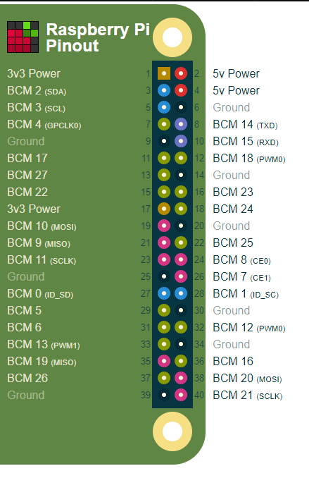

## Setup

#### Hardware
connect bt


#### WIFI Connection Script
- `sudo ifconfig wlan0 up`
- `sudo iwlist wlan0 scan | grep ESSID` -> send this as json via bt
- wait for a response from BT with command wifi
- `wpa_passphrase <ssid> <password> | sudo tee wifi.conf`
- `sudo wpa_supplicant -c /etc/wpa_supplicant.conf -i wlan0` -> run in background and monitor this process
- `sudo dhclient wlan0` get ip address

SHOULD BE CONNECTED TO THE INTERNET NOW

## files/
used to store random files

## pi/
Raspi Pinout (PI GPIO uses broadcom (BCM) pin notation)



- `check_wifi.sh` script that echos ok or error based on whether it can ping google.com (connection test)
- `pigpio.sh` runs pi-gpio daemon for generation of pwm signals
- `wpa_script.sh` generates wpa file, and attempts to connect to WPA enabled router
- `bt_serial.py` provides interface with serial bt device
- `api.py` provides interface with server
- `leds.py` provides interface to leds
- `logic.py` main file that runs the state machine logic
- `state.py` stores class for state
- `wifi_script.py` provides interface to connect to internet

## server/

Server API:
- `POST /device`
```json
{
    "id": "<uid>" 
}
```

- `POST /device/:id/poke`
```json
{
    "status":"ok",
}
```
```json
{
    "status":"device not found"
}
```

- `GET /device/:id/poke` with timeout
```json
{
    "poke": true
}
```
```json
{
    "poke": false
}
```
```json
{
    "status":"device not found"
}
```

- `POST /device/:code/activate`
```json
{
    "id": "<uuid>"
}
```
```json
{
    "status": "device not found"
}
```

- `GET /device/:code/activate`
```json
{
    "id": "<uuid>",
    "activated": "<true/false>"
}
```
hangs until activated

#### TODO:
- refactor api.py in tandem with logic.py to be more legible, better error handling
- remove unnecessary prints in pi script
- make react native app
- make RGB circuit
- add check for internet connection when aws server is unreachable